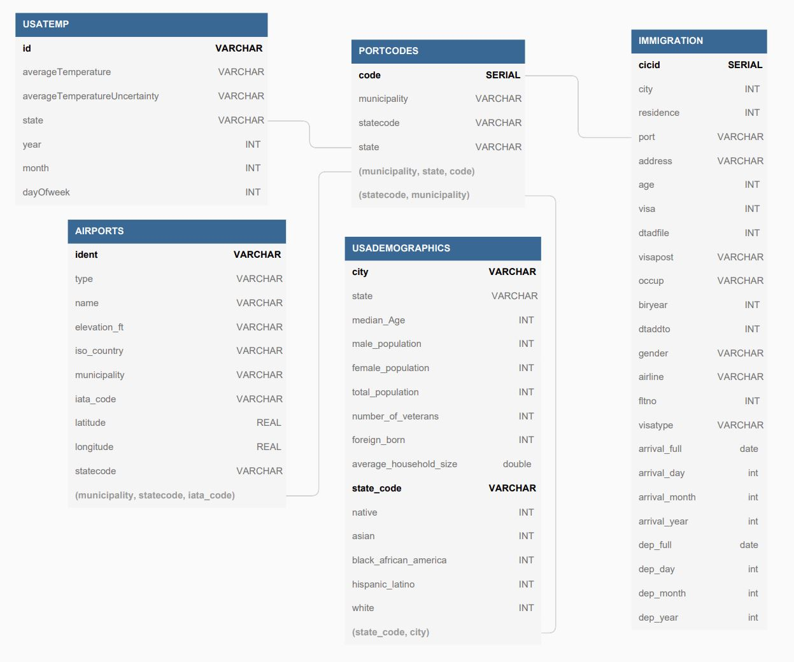

# Data Engineer - Capstone Project by Noam Jacobson

### Step 1: Scope the Project and Gather Data

For this project the following data sets were used:

| File Name      | Description    |
|----------------|---------------:|
| prtlCodes.json | Contains Codes that are associated to specific Airports |
| State_Codes.csv | Contains State Codes and their associated full names |
| airport-codes_csv.csv | Filled with Airport information such as their location, name, and type |
| GlobalLandTemperaturesByState.csv | Consists of average temperatures per country and state for every month |
| us-cities-demographics.csv | Comprises of data of US cities and their associated demographics |
| part-*-b9542815-7a8d-45fc-9c67-c9c5007ad0d4-c000.snappy.parquet | Contains rows of travelers and their associated information such as where they have landed and when |
    
These data sets will be prepared in such a way to allow data analysts to easily maneuver and join the data as they see fit. This will means the data will not be over normalized. The structure and data will help the analysts find patterns and useful information for better understanding of the incoming and existing population of the US.

-----

### Step 2: Explore and Assess the Data

**- Data Quality Issues -**

<table>
<thead>
	<tr>
		<th>Data set</th>
		<th>Quality Issues</th>
	</tr>
</thead>
<tbody>
	<tr>
		<td>prtlCodes.json</td>
		<td>-Port codes without names -Port codes with names as &quot;Collapsed&quot; therefore not giving the name of the collapsed code. -Port codes with country in the name rather than state/province.</td>
	</tr>
	<tr>
		<td>airport-codes_csv.csv</td>
		<td>-Longitude and latitude in the same column. -Region column contains country code when country code is avaialble in the iso_country column. -Some airports are closed flagged as closed. No date is provided of closure and therefore they cannot be used. -Multiple columsn are identical.  </td>
	</tr>
	<tr>
		<td>GlobalLandTemperaturesByState.csv</td>
		<td>-No Key to distinguish rows. -Empty values for Average Tempature and Average Tempature Uncertainty -Date column contains all date fields, year, month, day. These need to be separted  -Multiple columns are identical.</td>
	</tr>
	<tr>
		<td>us-cities-demographics.csv</td>
		<td>-Capitalized column names.   -Multiple rows with identical data except race and count. </td>
	</tr>
	<tr>
		<td>part-*-b9542815-7a8d-45fc-9c67-c9c5007ad0d4-c000.snappy.parquet</td>
		<td>-Arrival date and departure dates are in Julian days starting from 1960.   
		-Missing departure date.
		</td>
		
	</tr>
</tbody>
</table>

-----

### Step 3: Define the Data Model

The following data model was created based on the data sets provided. Given the only common element among all the data sets is location, I chose to create a Port Codes table which provides a way of joining all 4 tables. This will provide an easy way for analysts to find correlation between the seemingly different data. I have also decided to focus on US data only given most of the data sets exclusively contain US data.

**Data Model**

1. PORTCODES Table

- Load Air Port Codes (prtlCodes.json)
- Filter on Port Codes that do not have a State Code.
- Load State Codes (State_Codes.csv)
- Join Air Port Codes and State Codes on statecode.

2. AIRPORTS Table

- Load The Airport information (airport-codes_csv.csv) 
- Filter all countries except US, remove helicopter pads, a airports that are closed.
- Split coordinates to longitude and latitude columns.
- Split iso-region to new columns state.
- Lower case municipality.
- Drop iso-region, continent, coordinates, gps_codes, and local_code.
- Select Airports that are in the PORTCODES Table. Rank from Large to small, and select which ever comes first.

3. USATEMP Table

- Load Global Land Tempature File (GlobalLandTemperaturesByState.csv)
- Filter out only to include United States and removed Temps that are Nan.
- Create new column out of the DT column. Create year, month, dayOfWeek.
- Round AverageTempature and AverageTemperatureUncertainty to 3 decimal places.
- Created ID Key column from the date concatenated with state name.

4. USADEMOGRAPHICS Table

- Load Us Cities Demographics from file (us-cities-demographics.csv)
- Lower cast City and State columns to make it easy to join with other tables.
- Cast count to Integer.
- Pivot Race column to reduce duplicated rows with only difference of race and count.
- Rename all columns to remove spaces.
- Cast all columns to their correct data type.
- Only get rows with state and city that exist in PORTCODES.

5. IMMIGRATION

- Load Immigration data from files (*.snappy.parquet)
- Only focusing on mode of transportation which is Airplane. Hence filtering by i94mode to the value 1.
- Cast arrive date and departure date columns which are counts from the year 1960.
- Add the count of arrive date and departure date to 1960-01-01 dates and create new columns with day, month, year, and full date.
- Rename columns removing i94 from names.
- Cast all columns to their appropriate data type.

-----

### Step 4: Run ETL to Model the Data

**Data Dictionary:**
==The Data Dictionary is provided in the Data_dictionary.xlsx file in the git repository.==

**How to Execute:**
1. Download repository
2. Modify config.py with your personal S3 Access and Redshift information. 
3. Verify Spark is installed on the environment that will be used to execute the ETL job (Local machine or Jupyter). 
4. If using Jupyter execute line by line using file `SparkETL_Main_v3.ipynb`.                   
   Otherwise submit the spark job: 
   `$SPARK_HOME/bin/spark-submit SparkETL_Main_v3.py`
   
-----

### Step 5: Define the Data Model

The goal of this project was to create an ETL job which takes raw data from multiple data sets, manipulates it, and inserts it into a structured model. This in turn gives analysts and reporters clean and easily navigable data to use.

 -- **Tools Used** --

Spark was used to create the ETL job. The reason for picking Spark is due to the large volume of data that needs to be processed. Spark is an excellent tool that eases parallelism, distribution, and in memory processing therefore finishing the job faster.

Redshift was used as the database in this project because it is a columnar database which is perfect for warehousing data to be used by analysts and reporters given that data is selected by columns and not by rows. Redshift also makes it easy to increase or reduce the amount of hardware provided if the capacity and access of data is changed.

Airflow thought not currently used can be used in the future to automate the execution of this ETL job if it required to be executed on a repeating bases. Using Airflow the new or updated data set files would be placed or determined in the correct location for the ETL Spark job to use.

In order to incorporate Airflow and repetitive processing using the same ETL job the job would need to be modified to compare existing data in the Redshift Database and the new data before inserting into the database.

-- **Propose how often the data should be updated and why?** --

Data should be updated at a frequency which makes sense to the end users and as often as the data sets get refreshed. Meaning that if the analysts/reporters only use the data once a year there is no meaning of updating it hourly. The same logic concerns the data sets. If the data sets provided by 3rd party are only updated 3 times a year, nothing will be gained by running the ETL job daily.

-- **Include a description of how you would approach the problem differently under the following scenarios:** --

If the data that requires processing was to be increased by 100x clustering on the Spark application would be setup. A master and slave relationship would need to be configured hence distributing the data across multiple nodes to be processed therefore reducing the amount of time which it takes.  

If the pipelines were run on a daily basis by 7am an Airflow application would be setup to due the job. Error handling and email notifications would be added to confirm the pipeline ran successfully.

If the database needed to be accessed by 100+ people first an analysis would need to be conducted on the Redshift database to find which tables and columns are accessed the most and what sort of queries are being executed. It would be possible to create an OLAP cube that meets the users needs quicker, hence reducing processing time on the database. If the issue is simply that the hardware cannot keep up with the amount of times the data is accessed we could increase the size of the Redshift database by increasing the Node amount, vCPU, Memory, and storage capacity. It would also be possible to set the service type to on-demand which will increase and decrease the amount of hardware power dedicated depending on the usage requirements.

