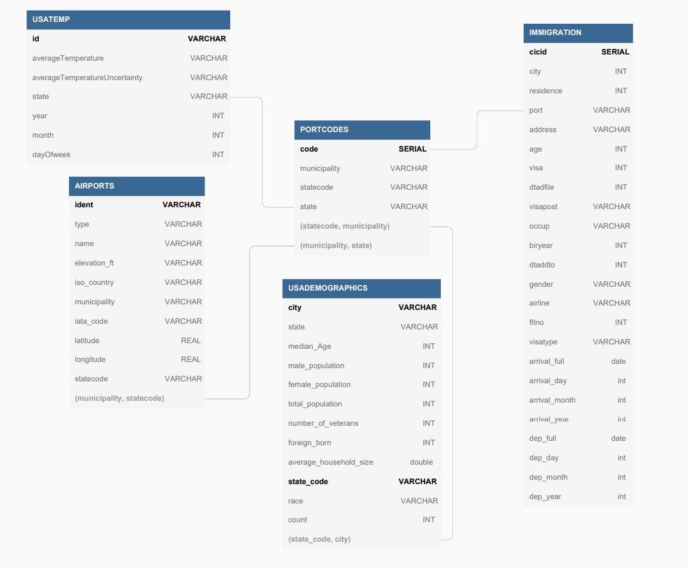

# NJ_CAP_Project

# Capstone Project - Noam Jacobson

**Step 1: Scope the Project and Gather Data**

For this project the following data sets were used:

| File Name      | Description    |
|----------------|---------------:|
| prtlCodes.json | Contains Codes that are associated to specific Airports |
| State_Codes.csv | Contains State Codes and their associated full names |
| airport-codes_csv.csv | Filled with Airport information such as their location, name, and type |
| GlobalLandTemperaturesByState.csv | Consists of average temperatures per country and state for every month |
| us-cities-demographics.csv | Comprises of data of US cities and their associated demographics |
| part-*-b9542815-7a8d-45fc-9c67-c9c5007ad0d4-c000.snappy.parquet | Contains rows of travelers and their associated information such as where they have landed and when |
    
> These data sets will be prepared in such a way to allow data analysts to easily maneuver and join    the data as they see fit. This will means the data will not be over normalized. The structure and    data will help the analysts find patterns and useful information for better understanding of the    incoming and existing population of the US.

**Step 2: Explore and Assess the Data**

**- Data Quality Issues -**

<table>
<thead>
	<tr>
		<th>Data set</th>
		<th>Quality Issues</th>
	</tr>
</thead>
<tbody>
	<tr>
		<td>prtlCodes.json</td>
		<td>-Port codes without names -Port codes with names as &quot;Collapsed&quot; therefore not giving the name of the collapsed code. -Port codes with country in the name rather than state/province.</td>
	</tr>
	<tr>
		<td>airport-codes_csv.csv</td>
		<td>-Longitude and latitude in the same column. -Region column contains country code when country code is avaialble in the iso_country column. -Some airports are closed flagged as closed. No date is provided of closure and therefore they cannot be used. -Multiple columsn are identical.  </td>
	</tr>
	<tr>
		<td>GlobalLandTemperaturesByState.csv</td>
		<td>-No Key to distinguish rows. -Empty values for Average Tempature and Average Tempature Uncertainty -Date column contains all date fields, year, month, day. These need to be separted  -Multiple columsn are identical.</td>
	</tr>
	<tr>
		<td>us-cities-demographics.csv</td>
		<td>-Capitalized column names.</td>
	</tr>
	<tr>
		<td>part-*-b9542815-7a8d-45fc-9c67-c9c5007ad0d4-c000.snappy.parquet</td>
		<td>-Arrival date and departure dates are in Julian days starting from 1960.   
		-Missing departure date.
		</td>
		
	</tr>
</tbody>
</table>

**Step 3: Define the Data Model**

> The following data model was created based on the data sets provided. Given the only common element among all the data sets is location, I chose to create a Port Codes table which provides a way of joining all 4 tables. This will provide an easy way for analysts to find correlation between the seemingly different data. I have also decided to focus on US data only given most of the data sets contain US data.

**- Data Model -**

1. PORTCODES Table

- Load Air Port Codes (prtlCodes.json)
- Filter on Port Codes that do not have a State Code.
- Load State Codes (State_Codes.csv)
- Join Air Port Codes and State Codes on statecode.

2. AIRPORTS Table

- Load The Airport information (airport-codes_csv.csv) 
- Filter all countries except US, remove helicopter pads, a airports that are closed.
- Split coordinates to longitude and latitude columns.
- Split iso-region to new columns state.
- Lower case municipality.
- Drop iso-region, continent, coordinates, gps_codes, and local_code.
- Select Airports that are in the PORTCODES Table. Rank from Large to small, and select which ever comes first.

3. USATEMP Table

- Load Global Land Tempature File (GlobalLandTemperaturesByState.csv)
- Filter out only to include United States and removed Temps that are Nan.
- Create new column out of the DT column. Create year, month, dayOfWeek.
- Created ID Key column from the date concatenated with state name.

4. USADEMOGRAPHICS Table

- Load Us Cities Demographics from file (us-cities-demographics.csv)
- Lower cast City and State columns to make it easy to join with other tables.
- Rename all columns to remove spaces.
- Only get rows with state and city that exist in PORTCODES.

5. IMMIGRATION

- Load Immigration data from files (*.snappy.parquet)
- Only focus on mode of transportation which is Airplane. Hence filtering by i94mode to the value 1.
